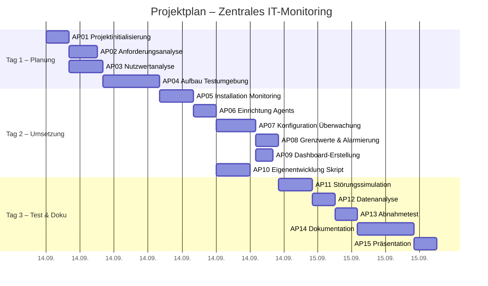
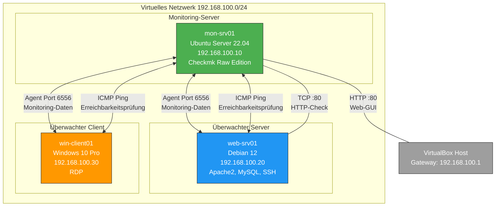

# Projektdokumentation: Einführung eines zentralen IT-Monitorings

---

**Projektname:** Einführung eines zentralen IT-Monitorings  
**Auftraggeber:** Müller & Partner GmbH  
**Auftragnehmer:** Grone Umschulungsteam  
**Projektlaufzeit:** 3 Projekttage  
**Datum:** September 2026  
**Version:** 1.0  

---

## Inhaltsverzeichnis

1. [Einleitung](#1-einleitung)
2. [Anforderungsanalyse (Abgabeprodukt A)](#2-anforderungsanalyse-abgabeprodukt-a)
3. [Nutzwertanalyse / Entscheidungsmatrix (Abgabeprodukt B)](#3-nutzwertanalyse--entscheidungsmatrix-abgabeprodukt-b)
4. [Projektplanung (Abgabeprodukt C)](#4-projektplanung-abgabeprodukt-c)
5. [Netzwerkplan (Abgabeprodukt D)](#5-netzwerkplan-abgabeprodukt-d)
6. [Technische Dokumentation (Abgabeprodukt E)](#6-technische-dokumentation-abgabeprodukt-e)
7. [Eigenentwicklung / Custom Check (Abgabeprodukt F)](#7-eigenentwicklung--custom-check-abgabeprodukt-f)
8. [Monitoring-Dashboard (Abgabeprodukt G)](#8-monitoring-dashboard-abgabeprodukt-g)
9. [Störungsprotokoll (Abgabeprodukt H)](#9-störungsprotokoll-abgabeprodukt-h)
10. [Datenanalyse (Abgabeprodukt I)](#10-datenanalyse-abgabeprodukt-i)
11. [Abnahmetest (Abgabeprodukt K)](#11-abnahmetest-abgabeprodukt-k)
12. [Projektergebnis und Fazit (Abgabeprodukt J)](#12-projektergebnis-und-fazit-abgabeprodukt-j)
13. [Anhang](#13-anhang)

---

## 1. Einleitung

### 1.1 Ausgangssituation

Die Müller & Partner GmbH ist ein mittelständisches Unternehmen, das seine IT-Infrastruktur in den vergangenen Jahren kontinuierlich erweitert hat. Neben zahlreichen Arbeitsplatzrechnern werden inzwischen mehrere Server für verschiedene interne Dienste betrieben. Hierzu gehören unter anderem Webserver für interne Webanwendungen, Dateiserver für die zentrale Dateiablage sowie Netzwerkdienste wie DNS und DHCP.

Die Überwachung dieser Systeme erfolgt derzeit überwiegend manuell. Dies bedeutet, dass Störungen und Ausfälle häufig erst dann erkannt werden, wenn Mitarbeiter aktiv ein Problem melden. Typische Szenarien, die in der Vergangenheit aufgetreten sind:

- Ein Server war nicht mehr erreichbar, ohne dass die IT-Abteilung dies bemerkte
- Ein Netzwerkdienst (z. B. DNS) fiel aus, was zu Verbindungsproblemen führte
- Eine Festplatte war vollständig belegt, was zu Datenverlust hätte führen können
- Eine dauerhaft hohe CPU-Auslastung beeinträchtigte die Systemleistung
- Arbeitsspeichermangel führte zu verlangsamten Reaktionszeiten
- Schlechte Antwortzeiten eines internen Webdienstes verursachten Produktivitätsverluste

Die Geschäftsführung der Müller & Partner GmbH bewertet diese Situation als nicht mehr ausreichend und hat daher ein IT-Projektteam mit der Lösung dieses Problems beauftragt.

### 1.2 Projektziel

Das Projektziel besteht in der Evaluation, Planung und prototypischen Einführung eines zentralen Monitoringsystems. Die Kernziele des Projekts lassen sich wie folgt zusammenfassen:

1. **Evaluation:** Mindestens drei Monitoring-Lösungen sollen untersucht und anhand definierter Kriterien verglichen werden
2. **Planung:** Eine strukturierte Projektplanung mit Arbeitspaketen, Verantwortlichkeiten und Zeitrahmen soll erstellt werden
3. **Prototypische Implementierung:** Die ausgewählte Lösung soll in einer virtuellen Testumgebung funktionsfähig implementiert werden
4. **Nachweis der Eignung:** Es soll nachgewiesen werden, dass die gewählte Lösung für den produktiven Einsatz bei der Müller & Partner GmbH grundsätzlich geeignet ist

Mit dem zukünftigen System soll die IT-Abteilung in der Lage sein, den Zustand wichtiger Systeme und Dienste zentral zu überwachen. Störungen und kritische Systemzustände sollen möglichst erkannt werden, bevor Benutzer diese melden.

### 1.3 Projektumfang und Abgrenzung

Das Projekt umfasst die Erstellung eines Proof of Concept (PoC) in einer virtuellen Testumgebung. Es handelt sich ausdrücklich **nicht** um eine produktive Einführung. Die Projektlaufzeit beträgt ca. 3 Projekttage.

**Im Projektumfang enthalten:**
- Nutzwertanalyse zur Produktauswahl
- Aufbau einer virtuellen Testumgebung
- Installation und Konfiguration der Monitoring-Lösung
- Überwachung mehrerer Systeme und Dienste
- Eigenentwicklung eines Custom Checks
- Störungssimulation und Analyse
- Vollständige Dokumentation

**Nicht im Projektumfang enthalten:**
- Migration produktiver Systeme
- Anbindung physischer Netzwerkhardware (Switches, Router)
- Langfristiger Betrieb des Monitoring-Systems
- Schulung der Endanwender

---

## 2. Anforderungsanalyse (Abgabeprodukt A)

### 2.1 MUSS-Anforderungen

Die folgenden elf MUSS-Anforderungen wurden aus dem Kundenauftrag der Müller & Partner GmbH abgeleitet. Alle Anforderungen sind verbindlich und müssen vor Projektabschluss erfüllt sein.

| ID | Anforderung | Beschreibung | Priorität | Status |
|----|-------------|--------------|-----------|--------|
| M01 | Zentrale Monitoring-Lösung | Es muss ein zentraler Monitoring-Server eingerichtet werden, der als zentrale Überwachungsinstanz fungiert. | Hoch | Erfüllt ✅ |
| M02 | Mehrere Systeme | Mindestens zwei weitere virtuelle Systeme müssen durch den Monitoring-Server überwacht werden. | Hoch | Erfüllt ✅ |
| M03 | Erreichbarkeit | Das Monitoring muss erkennen können, ob ein überwachtes System erreichbar ist (z. B. via ICMP-Ping). | Hoch | Erfüllt ✅ |
| M04 | Systemressourcen | Mindestens folgende Werte müssen überwacht werden: CPU-Auslastung, Arbeitsspeicherauslastung, Festplattenbelegung. | Hoch | Erfüllt ✅ |
| M05 | Netzwerkdienst | Mindestens ein Netzwerkdienst (z. B. HTTP, SSH, DNS) muss aktiv überwacht werden. | Hoch | Erfüllt ✅ |
| M06 | Grenzwerte | Für ausgewählte Messwerte müssen sinnvolle Warn- und Fehlergrenzen definiert und begründet werden. | Mittel | Erfüllt ✅ |
| M07 | Alarmierung | Das Monitoring-System muss mindestens einen kritischen Zustand automatisch erkennen und als Warnung/Alarm darstellen. | Hoch | Erfüllt ✅ |
| M08 | Dashboard | Es muss eine zentrale Übersicht erstellt werden, auf der der Zustand der überwachten Infrastruktur erkennbar ist. | Hoch | Erfüllt ✅ |
| M09 | Eigener Messwert | Ein eigenes Skript oder Programm muss entwickelt werden, das einen Messwert erzeugt und in das Monitoring integriert wird. | Mittel | Erfüllt ✅ |
| M10 | Störungssimulation | Mindestens drei unterschiedliche Störungen müssen gezielt erzeugt und durch das Monitoring erkannt werden. | Hoch | Erfüllt ✅ |
| M11 | Abnahmetest | Für die implementierte Lösung muss ein nachvollziehbarer Abnahmetest erstellt und durchgeführt werden. | Hoch | Erfüllt ✅ |

**Ergebnis:** Alle 11 MUSS-Anforderungen wurden vollständig erfüllt.

### 2.2 KANN-Anforderungen

Nach erfolgreicher Umsetzung aller MUSS-Anforderungen wurden zusätzlich folgende KANN-Anforderungen betrachtet:

| ID | Anforderung | Beschreibung | Status |
|----|-------------|--------------|--------|
| K01 | E-Mail-Alarmierung | Automatische E-Mail-Benachrichtigung bei einer Störung. | Umgesetzt ✅ |
| K02 | Erweiterte Dashboards | Erstellung zusätzlicher grafischer Auswertungen über die Mindestanforderung hinaus. | Umgesetzt ✅ |
| K03 | Automatisierung | Automatisierte Installation oder Konfiguration eines Monitoring-Agenten (z. B. per Skript/Ansible). | Nicht umgesetzt ⬜ |
| K04 | Erweiterte Eigenentwicklung | Entwicklung eines eigenen Monitoring-Checks mit mehreren Messwerten oder Zuständen. | Umgesetzt ✅ |
| K05 | Verfügbarkeitsauswertung | Auswertung, wie lange ein System oder Dienst während des Testzeitraums verfügbar war. | Nicht umgesetzt ⬜ |

**Ergebnis:** 3 von 5 KANN-Anforderungen wurden zusätzlich umgesetzt.

### 2.3 Anforderungsrückverfolgbarkeit

Die Rückverfolgbarkeit der Anforderungen wird durch das Abnahmetestprotokoll in Kapitel 11 sichergestellt. Jeder Test ist einer spezifischen MUSS-Anforderung zugeordnet.

---

## 3. Nutzwertanalyse / Entscheidungsmatrix (Abgabeprodukt B)

### 3.1 Untersuchte Monitoring-Systeme

Gemäß Kundenauftrag wurden mindestens drei Monitoring-Systeme untersucht und miteinander verglichen. Die Auswahl der zu untersuchenden Produkte erfolgte auf Basis der Marktrelevanz, der Verfügbarkeit als Open-Source-Lösung und der grundsätzlichen Eignung für die Anforderungen der Müller & Partner GmbH.

#### 3.1.1 Checkmk Raw Edition

**Beschreibung:**  
Checkmk ist eine umfassende IT-Monitoring-Lösung, die ursprünglich als Erweiterung für Nagios entwickelt wurde und mittlerweile auf einem eigenen Monitoring-Kern (CMC in der Enterprise Edition, Nagios-Kern in der Raw Edition) basiert. Die Raw Edition ist vollständig Open Source und kostenlos verfügbar.

**Wichtigste Eigenschaften:**
- Intuitive webbasierte Administrationsoberfläche (WATO/Setup)
- Automatische Service-Erkennung (Auto-Discovery)
- Agent-basierte Überwachung mit vorinstalliertem Agent für Linux und Windows
- Über 2.000 vorgefertigte Check-Plugins
- Integrierte Graphendarstellung (PNP4Nagios / interne Graphen)
- Regelbasierte Konfiguration
- Integriertes Benachrichtigungssystem

**Vorteile:**
- Sehr einfache Einrichtung und Bedienung
- Automatische Erkennung von Diensten und Metriken
- Umfangreiche vorgefertigte Überwachungs-Checks
- Professionelle Dokumentation

**Nachteile:**
- Raw Edition hat eingeschränkten Funktionsumfang gegenüber Enterprise
- Eigener Monitoring-Kern nur in Enterprise Edition
- Höherer Ressourcenbedarf als Nagios Core

**Lizenzmodell:** GNU GPL v2 (Raw Edition), kommerzielle Lizenz (Enterprise/Cloud Edition)

#### 3.1.2 Zabbix

**Beschreibung:**  
Zabbix ist eine Enterprise-Class Open-Source-Monitoring-Lösung, die seit 2001 entwickelt wird. Sie bietet sowohl Agent-basierte als auch agentenlose Überwachung und verfügt über ein leistungsstarkes Template-System zur Wiederverwendung von Konfigurationen.

**Wichtigste Eigenschaften:**
- Vollständig Open Source ohne funktional eingeschränkte Editionen
- Agent-basiert und agentenlos (SNMP, IPMI, JMX)
- Umfangreiches Template-System
- Leistungsstarke Visualisierung und Dashboards
- Trigger-basierte Alarmierung
- Auto-Discovery und Low-Level-Discovery
- Native Unterstützung für verteiltes Monitoring

**Vorteile:**
- Keine funktionalen Einschränkungen in der kostenlosen Version
- Sehr große und aktive Community
- Umfangreiche Template-Bibliothek
- Flexible Trigger- und Eskalationsmechanismen
- Unterstützung für sehr große Umgebungen

**Nachteile:**
- Steilere Lernkurve bei der Erstkonfiguration
- Weboberfläche weniger intuitiv als bei Checkmk
- Datenbankabhängigkeit (MySQL/PostgreSQL erforderlich)
- Initiale Template-Konfiguration zeitaufwändig

**Lizenzmodell:** GNU GPL v2

#### 3.1.3 Nagios Core

**Beschreibung:**  
Nagios Core ist der Urahn der Open-Source-Monitoring-Lösungen und bildet die Basis vieler moderner Monitoring-Systeme (u. a. Checkmk, Icinga). Es ist extrem flexibel und erweiterbar, erfordert aber erheblichen manuellen Konfigurationsaufwand.

**Wichtigste Eigenschaften:**
- Leichtgewichtiger Monitoring-Kern
- Plugin-basierte Architektur mit tausenden verfügbaren Plugins
- Konfiguration über Textdateien
- Grundlegende Weboberfläche (CGI-basiert)
- Externe Befehle und Event-Handler
- Sehr große Plugin-Community

**Vorteile:**
- Minimaler Ressourcenbedarf
- Extrem flexibel und erweiterbar
- Riesige Plugin-Bibliothek
- Langjährig bewährt und stabil
- Referenzlösung im Monitoring-Bereich

**Nachteile:**
- Veraltete Weboberfläche ohne moderne Dashboards
- Keine automatische Service-Erkennung
- Manuelle Konfiguration über Textdateien erforderlich
- Keine integrierten Graphen (externe Tools nötig wie PNP4Nagios)
- Hoher Einrichtungsaufwand

**Lizenzmodell:** GNU GPL v2

### 3.2 Bewertungskriterien und Gewichtung

Die Bewertungskriterien wurden unter Berücksichtigung der spezifischen Anforderungen der Müller & Partner GmbH entwickelt. Die Gewichtung spiegelt die Prioritäten des Unternehmens wider:

| Nr. | Kriterium | Gewichtung | Begründung der Gewichtung |
|-----|-----------|------------|---------------------------|
| 1 | Kosten und Lizenzmodell | 10 % | Alle drei Kandidaten sind Open Source, daher weniger differenzierend |
| 2 | Bedienbarkeit | 20 % | Zentral für die Akzeptanz durch die IT-Mitarbeiter |
| 3 | Betriebssystem-Unterstützung | 10 % | Linux und Windows müssen unterstützt werden |
| 4 | Überwachung Netzwerkdienste | 15 % | Kernfunktion des Monitoring-Systems |
| 5 | Alarmierung | 15 % | Kernfunktion für proaktive Störungserkennung |
| 6 | Visualisierung und Dashboards | 15 % | Wichtig für schnelle Statusübersicht |
| 7 | Erweiterbarkeit | 5 % | Für zukünftige Anpassungen relevant |
| 8 | Dokumentation und Community | 5 % | Unterstützt die eigenständige Administration |
| 9 | Ressourcenbedarf | 5 % | Sollte in die bestehende Infrastruktur passen |
| | **Gesamt** | **100 %** | |

### 3.3 Nutzwertmatrix

Bewertungsskala: 1 (sehr schlecht) bis 5 (sehr gut)

| Kriterium | Gewichtung | Checkmk Raw | | Zabbix | | Nagios Core | |
|-----------|-----------|------|------|--------|------|-------------|------|
| | | Punkte | Gewichtet | Punkte | Gewichtet | Punkte | Gewichtet |
| Kosten/Lizenz | 10 % | 5 | 0,50 | 5 | 0,50 | 5 | 0,50 |
| Bedienbarkeit | 20 % | 5 | 1,00 | 3 | 0,60 | 2 | 0,40 |
| OS-Unterstützung | 10 % | 4 | 0,40 | 5 | 0,50 | 4 | 0,40 |
| Netzwerkdienste | 15 % | 4 | 0,60 | 5 | 0,75 | 4 | 0,60 |
| Alarmierung | 15 % | 4 | 0,60 | 4 | 0,60 | 3 | 0,45 |
| Visualisierung | 15 % | 5 | 0,75 | 4 | 0,60 | 2 | 0,30 |
| Erweiterbarkeit | 5 % | 4 | 0,20 | 5 | 0,25 | 5 | 0,25 |
| Doku/Community | 5 % | 4 | 0,20 | 5 | 0,25 | 4 | 0,20 |
| Ressourcenbedarf | 5 % | 3 | 0,15 | 3 | 0,15 | 4 | 0,20 |
| **Gesamt** | **100 %** | | **4,40** | | **4,20** | | **3,30** |

### 3.4 Ergebnis und Begründung der Produktauswahl

**Ergebnis: Checkmk Raw Edition wird als Monitoring-Lösung ausgewählt.**

Die Nutzwertanalyse ergibt folgende Rangfolge:

| Rang | Produkt | Gesamtpunktzahl |
|------|---------|-----------------|
| 1 | **Checkmk Raw Edition** | **4,40 / 5,00** |
| 2 | Zabbix | 4,20 / 5,00 |
| 3 | Nagios Core | 3,30 / 5,00 |

**Begründung der Auswahl von Checkmk Raw Edition:**

1. **Bedienbarkeit (5/5):** Checkmk bietet die intuitivste Weboberfläche aller untersuchten Lösungen. Die Konfiguration erfolgt vollständig über die GUI (WATO/Setup), was die Einarbeitungszeit der IT-Mitarbeiter erheblich verkürzt.

2. **Automatische Service-Erkennung:** Nach Installation des Agenten erkennt Checkmk automatisch alle relevanten Services, Dateisysteme, Netzwerkinterfaces und laufende Prozesse. Dies spart erheblichen Konfigurationsaufwand.

3. **Visualisierung (5/5):** Checkmk bietet integrierte Dashboards, Graphen und taktische Übersichten ohne zusätzliche Erweiterungen. Die „Tactical Overview" ermöglicht den geforderten „Blick auf einen Blick".

4. **Kosteneffizienz:** Die Raw Edition ist vollständig kostenlos und bietet für die Anforderungen der Müller & Partner GmbH einen ausreichenden Funktionsumfang. Ein späteres Upgrade auf die Enterprise Edition ist möglich.

5. **Einfache Installation:** Die Installation erfolgt über ein einziges Paket und ist innerhalb weniger Minuten abgeschlossen.

6. **Agent-Verfügbarkeit:** Vorgefertigte Agenten für Linux und Windows sind direkt über die Weboberfläche herunterladbar.

Obwohl Zabbix in einigen Einzelkategorien (z. B. Betriebssystem-Unterstützung, Erweiterbarkeit) bessere Bewertungen erzielt, überwiegen die Vorteile von Checkmk in den hoch gewichteten Kategorien Bedienbarkeit und Visualisierung.

Nagios Core scheidet aufgrund der veralteten Weboberfläche, des hohen manuellen Konfigurationsaufwands und fehlender integrierter Dashboards aus.

---

## 4. Projektplanung (Abgabeprodukt C)

### 4.1 Arbeitspakete

Die folgende Tabelle zeigt alle Arbeitspakete des Projekts mit geplanter und tatsächlicher Bearbeitungszeit:

| AP | Bezeichnung | Verantwortlich | Geplante Dauer | Tatsächliche Dauer | Abhängigkeit | Erwartetes Ergebnis |
|----|-------------|----------------|----------------|--------------------|--------------|--------------------|
| AP01 | Projektinitialisierung | Projektleitung | 2,0 h | 2,0 h | – | Projektplan, Teamaufteilung |
| AP02 | Anforderungsanalyse | Team A | 2,0 h | 2,5 h | AP01 | Anforderungsdokument mit MUSS/KANN |
| AP03 | Nutzwertanalyse | Team B | 3,0 h | 3,0 h | AP01 | Entscheidungsmatrix, Produktauswahl |
| AP04 | Aufbau Testumgebung | Team A + B | 4,0 h | 5,0 h | AP03 | 3 VMs lauffähig, Netzwerk konfiguriert |
| AP05 | Installation Monitoring-Server | Team A | 3,0 h | 3,0 h | AP04 | Checkmk installiert und erreichbar |
| AP06 | Einrichtung Monitoring-Agents | Team B | 2,0 h | 2,0 h | AP05 | Agents auf allen Hosts installiert |
| AP07 | Konfiguration Überwachung | Team A | 3,0 h | 3,5 h | AP06 | Alle Hosts und Services konfiguriert |
| AP08 | Grenzwerte und Alarmierung | Team B | 2,0 h | 2,0 h | AP07 | Schwellwerte definiert und aktiv |
| AP09 | Dashboard-Erstellung | Team A | 2,0 h | 1,5 h | AP07 | Funktionsfähiges Dashboard |
| AP10 | Eigenentwicklung Skript | Team B | 3,0 h | 3,0 h | AP06 | Custom Check integriert |
| AP11 | Störungssimulation | Team A + B | 3,0 h | 3,0 h | AP08 | Störungsprotokoll erstellt |
| AP12 | Datenanalyse | Team A | 2,0 h | 2,0 h | AP11 | Auswertungsbericht |
| AP13 | Abnahmetest | Team A + B | 2,0 h | 2,0 h | AP07–AP12 | Testprotokoll |
| AP14 | Dokumentation | Team A + B | 4,0 h | 5,0 h | Alle | Vollständige Projektdokumentation |
| AP15 | Präsentation | Projektleitung | 2,0 h | 2,0 h | AP14 | Abschlusspräsentation |
| | **Gesamt** | | **39,0 h** | **41,5 h** | | |

### 4.2 Zeitplan (Gantt-Darstellung)



### 4.3 Parallelisierbare Aufgaben

Folgende Arbeitspakete können parallel bearbeitet werden:

- **AP02 und AP03:** Die Anforderungsanalyse und die Nutzwertanalyse können zeitgleich durch verschiedene Teammitglieder bearbeitet werden, da sie inhaltlich unabhängig sind.
- **AP09 und AP10:** Die Dashboard-Erstellung und die Eigenentwicklung des Custom Checks können parallel erfolgen, da beide auf der bereits konfigurierten Überwachung aufbauen, aber voneinander unabhängig sind.

### 4.4 Soll-Ist-Vergleich der Projektzeiten

| Kennzahl | Geplant | Tatsächlich | Abweichung |
|----------|---------|-------------|------------|
| Gesamtdauer | 39,0 h | 41,5 h | +2,5 h (+6,4 %) |
| Tag 1 | 12,0 h | 13,5 h | +1,5 h |
| Tag 2 | 15,5 h | 15,0 h | -0,5 h |
| Tag 3 | 11,5 h | 13,0 h | +1,5 h |

**Analyse der Abweichungen:**

1. **AP02 Anforderungsanalyse (+0,5 h):** Die Detaillierung der MUSS-Anforderungen erforderte mehr Abstimmung als ursprünglich geplant.
2. **AP04 Aufbau Testumgebung (+1,0 h):** Die Netzwerkkonfiguration der virtuellen Maschinen war aufwändiger als erwartet. Insbesondere die Konfiguration des internen Netzwerks in VirtualBox erforderte mehrere Anpassungsschritte.
3. **AP07 Konfiguration Überwachung (+0,5 h):** Die Feinabstimmung der Service-Erkennung für den Windows-Client war zeitintensiver als geplant.
4. **AP09 Dashboard-Erstellung (-0,5 h):** Die integrierten Dashboard-Vorlagen von Checkmk beschleunigten die Erstellung.
5. **AP14 Dokumentation (+1,0 h):** Die vollständige Dokumentation aller Konfigurationsschritte und Testergebnisse erforderte mehr Zeit.

Die Gesamtabweichung von +6,4 % liegt in einem akzeptablen Rahmen. Die Mehrarbeit war primär auf den Aufbau der Testumgebung und die Dokumentation zurückzuführen.

---

## 5. Netzwerkplan (Abgabeprodukt D)

### 5.1 Übersicht der Testumgebung

Für den Proof of Concept wurde eine vollständig virtuelle Testumgebung aufgebaut. Als Virtualisierungslösung kommt Oracle VirtualBox zum Einsatz. Alle drei virtuellen Maschinen sind über ein internes Netzwerk (Host-only Adapter) miteinander verbunden.

**Netzwerkkonfiguration:**
- **Netzwerk:** 192.168.100.0/24
- **Subnetzmaske:** 255.255.255.0
- **Gateway:** 192.168.100.1 (Host-System)
- **DNS:** 192.168.100.1

### 5.2 Systemübersicht

| Hostname | Rolle | Betriebssystem | IP-Adresse | vCPU | RAM | HDD | Installierte Dienste |
|----------|-------|----------------|------------|------|-----|-----|---------------------|
| mon-srv01 | Monitoring-Server | Ubuntu Server 22.04 LTS | 192.168.100.10 | 2 | 4 GB | 40 GB | Checkmk Raw Edition, Apache2, SSH |
| web-srv01 | Überwachter Server | Debian 12 (Bookworm) | 192.168.100.20 | 1 | 2 GB | 20 GB | Apache2, MySQL 8.0, SSH, Checkmk Agent |
| win-client01 | Überwachter Client | Windows 10 Pro | 192.168.100.30 | 2 | 4 GB | 50 GB | RDP, Checkmk Agent |

### 5.3 Netzwerkdiagramm



**Legende:**
- 🟢 **Grün:** Monitoring-Server (zentrale Instanz)
- 🔵 **Blau:** Überwachter Linux-Server
- 🟠 **Orange:** Überwachter Windows-Client
- ⚪ **Grau:** VirtualBox Host-System

### 5.4 Kommunikationsmatrix

| Quelle | Ziel | Port | Protokoll | Zweck |
|--------|------|------|-----------|-------|
| mon-srv01 | web-srv01 | 6556/TCP | Checkmk Agent | Monitoring-Daten abrufen |
| mon-srv01 | win-client01 | 6556/TCP | Checkmk Agent | Monitoring-Daten abrufen |
| mon-srv01 | web-srv01 | ICMP | Ping | Erreichbarkeitsprüfung |
| mon-srv01 | win-client01 | ICMP | Ping | Erreichbarkeitsprüfung |
| mon-srv01 | web-srv01 | 80/TCP | HTTP | Webdienst-Überwachung |
| Admin-PC | mon-srv01 | 80/TCP | HTTP | Zugriff auf Checkmk Web-GUI |
| Admin-PC | web-srv01 | 22/TCP | SSH | Administration |
| Admin-PC | win-client01 | 3389/TCP | RDP | Administration |

---

## 6. Technische Dokumentation (Abgabeprodukt E)

### 6.1 Installation des Monitoring-Servers (mon-srv01)

#### 6.1.1 Vorbereitung: Ubuntu Server 22.04 LTS

Nach der Grundinstallation von Ubuntu Server 22.04 LTS in VirtualBox werden zunächst grundlegende Systemkonfigurationen durchgeführt:

```bash
# System aktualisieren
sudo apt update && sudo apt upgrade -y

# Hostnamen setzen
sudo hostnamectl set-hostname mon-srv01

# Statische IP-Adresse konfigurieren
sudo nano /etc/netplan/00-installer-config.yaml
```

Netplan-Konfiguration:

```yaml
network:
  version: 2
  ethernets:
    enp0s3:
      addresses:
        - 192.168.100.10/24
      routes:
        - to: default
          via: 192.168.100.1
      nameservers:
        addresses:
          - 192.168.100.1
          - 8.8.8.8
```

```bash
# Netplan-Konfiguration anwenden
sudo netplan apply

# /etc/hosts anpassen
sudo nano /etc/hosts
```

Eintrag in `/etc/hosts`:

```
192.168.100.10  mon-srv01
192.168.100.20  web-srv01
192.168.100.30  win-client01
```

#### 6.1.2 Installation von Checkmk Raw Edition

```bash
# Checkmk-Paket herunterladen (Version 2.2.0p1 für Ubuntu 22.04)
wget https://download.checkmk.com/checkmk/2.2.0p1/check-mk-raw-2.2.0p1_0.jammy_amd64.deb

# Paket installieren (installiert automatisch alle Abhängigkeiten)
sudo apt install -y ./check-mk-raw-2.2.0p1_0.jammy_amd64.deb

# Falls Abhängigkeiten fehlen:
sudo apt --fix-broken install -y
```

#### 6.1.3 Erstellen und Starten der Monitoring-Instanz

```bash
# Monitoring-Instanz erstellen (Name: "monitoring")
sudo omd create monitoring

# Ausgabe enthält initiales Admin-Passwort – unbedingt notieren!
# Die Instanz wird unter /omd/sites/monitoring/ angelegt.

# Monitoring-Instanz starten
sudo omd start monitoring

# Status der Instanz prüfen
sudo omd status monitoring
```

Erwartete Ausgabe bei erfolgreicher Installation:

```
mkeventd:       running
liveproxyd:     running
mknotifyd:      running
rrdcached:      running
cmc:            running
apache:         running
crontab:        running
-----------------------------------------
Overall state:  running
```

#### 6.1.4 Erster Zugriff auf die Web-GUI

Die Checkmk-Weboberfläche ist nun unter folgender URL erreichbar:

```
http://192.168.100.10/monitoring
```

- **Benutzername:** cmkadmin
- **Passwort:** (wurde bei `omd create` ausgegeben)

Nach dem ersten Login sollte das Passwort über die Benutzerverwaltung geändert werden.

### 6.2 Installation des Agents auf dem Linux-Server (web-srv01)

#### 6.2.1 Vorbereitung: Debian 12

```bash
# System aktualisieren
sudo apt update && sudo apt upgrade -y

# Hostnamen setzen
sudo hostnamectl set-hostname web-srv01

# Statische IP konfigurieren (Debian verwendet /etc/network/interfaces)
sudo nano /etc/network/interfaces
```

Netzwerkkonfiguration:

```
auto enp0s3
iface enp0s3 inet static
    address 192.168.100.20
    netmask 255.255.255.0
    gateway 192.168.100.1
    dns-nameservers 192.168.100.1 8.8.8.8
```

```bash
# Netzwerk neu starten
sudo systemctl restart networking
```

#### 6.2.2 Installation der Netzwerkdienste

```bash
# Apache2 Webserver installieren
sudo apt install -y apache2
sudo systemctl enable apache2
sudo systemctl start apache2

# Testseite erstellen
echo "<h1>Müller & Partner GmbH - Interner Webserver</h1>" | \
    sudo tee /var/www/html/index.html

# MySQL Server installieren
sudo apt install -y mysql-server
sudo systemctl enable mysql
sudo systemctl start mysql

# MySQL absichern
sudo mysql_secure_installation

# SSH-Server prüfen (ist bei Debian standardmäßig installiert)
sudo systemctl status sshd
```

#### 6.2.3 Installation des Checkmk-Agents

Der Agent wird direkt aus der Checkmk-Weboberfläche heruntergeladen:

```bash
# Agent vom Monitoring-Server herunterladen
wget http://192.168.100.10/monitoring/check_mk/agents/check-mk-agent_2.2.0p1-1_all.deb

# Agent installieren
sudo dpkg -i check-mk-agent_2.2.0p1-1_all.deb

# Agent-Port 6556 prüfen
ss -tlnp | grep 6556

# Agent manuell testen
check_mk_agent
```

#### 6.2.4 Firewall-Konfiguration

```bash
# UFW installieren und konfigurieren
sudo apt install -y ufw

# Regeln erstellen
sudo ufw allow 22/tcp    # SSH
sudo ufw allow 80/tcp    # HTTP
sudo ufw allow 6556/tcp  # Checkmk Agent
sudo ufw enable

# Regeln prüfen
sudo ufw status verbose
```

### 6.3 Installation des Agents auf dem Windows-Client (win-client01)

#### 6.3.1 Vorbereitung: Windows 10

1. **Netzwerk konfigurieren:**
   - Systemsteuerung → Netzwerk- und Freigabecenter → Adaptereinstellungen ändern
   - Rechtsklick auf Netzwerkadapter → Eigenschaften → IPv4
   - IP-Adresse: 192.168.100.30
   - Subnetzmaske: 255.255.255.0
   - Gateway: 192.168.100.1
   - DNS: 192.168.100.1

2. **Computernamen ändern:**
   - Einstellungen → System → Info → „Diesen PC umbenennen"
   - Neuer Name: win-client01

#### 6.3.2 Installation des Checkmk-Agents

1. **Agent herunterladen:**
   - Browser öffnen: `http://192.168.100.10/monitoring`
   - Anmelden als cmkadmin
   - Navigation: Setup → Agents → Windows → Agent MSI-Paket herunterladen

2. **Agent installieren:**
   - Heruntergeladene `.msi`-Datei als Administrator ausführen
   - Installationsassistent durchlaufen (Standard-Einstellungen)
   - Installation abschließen

3. **Windows-Firewall konfigurieren:**
   - Windows Defender Firewall → Erweiterte Einstellungen
   - Eingehende Regeln → Neue Regel
   - Regeltyp: Port → TCP → Port 6556 → Zulassen
   - Name: „Checkmk Agent"

4. **Agent-Dienst prüfen:**
   - PowerShell als Administrator öffnen:
   ```powershell
   Get-Service CheckMkAgent
   netstat -an | findstr 6556
   ```

### 6.4 Konfiguration der Überwachung in Checkmk

#### 6.4.1 Hosts hinzufügen

Für jeden zu überwachenden Host wird folgender Ablauf in der Checkmk-Weboberfläche durchgeführt:

1. **Navigation:** Setup → Hosts → „Add host"
2. **Host-Daten eingeben:**
   - Hostname: `web-srv01` (bzw. `win-client01`)
   - IP-Adresse: 192.168.100.20 (bzw. 192.168.100.30)
   - Agent-Typ: Checkmk agent (Pull-Modus)
3. **Speichern und Service Discovery:**
   - „Save & go to service configuration" klicken
   - Erkannte Services prüfen
   - „Accept all" für alle gewünschten Services
4. **Aktivieren:**
   - Gelbe Schaltfläche „Changes" oben rechts
   - „Activate on affected sites" klicken

#### 6.4.2 Erkannte Services

Nach der automatischen Service-Erkennung wurden folgende Services erfasst:

**web-srv01 (Debian 12):**
- PING (Erreichbarkeit)
- CPU load (CPU-Auslastung)
- CPU utilization (CPU-Nutzung nach Typ)
- Memory (Arbeitsspeicher)
- Filesystem / (Dateisystem Root)
- Interface eth0 (Netzwerkinterface)
- Apache Status (HTTP-Dienst)
- MySQL sessions (Datenbank-Dienst)
- SSH service (SSH-Dienst)
- Active TCP Connections (Custom Check)
- NTP Time (Zeitsynchronisation)
- Uptime (Betriebszeit)
- Kernel Performance (Kernel-Metriken)

**win-client01 (Windows 10):**
- PING (Erreichbarkeit)
- Processor Queue Length (CPU-Last)
- Memory (Arbeitsspeicher)
- Filesystem C: (Dateisystem C:)
- Interface Ethernet (Netzwerkinterface)
- Windows Services (Dienste-Übersicht)
- Uptime (Betriebszeit)

### 6.5 Konfiguration der Grenzwerte (M06)

Die folgenden Schwellwerte wurden in Checkmk konfiguriert. Jeder Grenzwert wurde auf Basis von Best Practices und den spezifischen Anforderungen der Testumgebung gewählt:

| Messwert | Warnung (WARN) | Kritisch (CRIT) | Begründung |
|----------|----------------|-----------------|------------|
| CPU-Auslastung | > 80 % für 5 Minuten | > 95 % für 5 Minuten | Eine dauerhaft hohe CPU-Auslastung über 80 % deutet auf Ressourcenmangel hin. Das Zeitfenster von 5 Minuten verhindert Fehlalarme bei kurzzeitigen Lastspitzen. |
| RAM-Auslastung | > 85 % | > 95 % | Ab 85 % Auslastung beginnt Linux zu swappen, was die Systemperformance beeinträchtigt. Ab 95 % besteht die Gefahr eines Out-of-Memory-Fehlers. |
| Festplattenbelegung | > 85 % belegt | > 95 % belegt | Eine Belegung über 85 % gibt dem Administrator noch ausreichend Zeit zum Handeln. Ab 95 % können Systemprobleme auftreten (keine Logs mehr schreibbar, keine temporären Dateien). |
| HTTP-Antwortzeit | > 2 Sekunden | > 5 Sekunden | Die Benutzererfahrung verschlechtert sich merklich ab 2 Sekunden Ladezeit. Ab 5 Sekunden ist der Dienst faktisch nicht mehr nutzbar. |
| SSH-Dienst | – | Nicht erreichbar | SSH muss für die Administration jederzeit verfügbar sein. Jede Nichterreichbarkeit ist sofort kritisch. |
| MySQL-Verbindungen | > 80 % der max_connections | > 90 % der max_connections | Zeigt an, dass der Datenbankserver an die Kapazitätsgrenze stößt. |

**Konfiguration in Checkmk:**

Die Schwellwerte werden über regelbasierte Konfiguration gesetzt:
- Setup → Services → Service monitoring rules → Entsprechende Regel auswählen
- Schwellwerte eintragen und auf die relevanten Hosts/Services einschränken
- Änderungen aktivieren

### 6.6 Konfiguration der Alarmierung (M07 / K01)

#### Benachrichtigungsregeln

In Checkmk wurde folgende Benachrichtigungskonfiguration eingerichtet:

1. **E-Mail-Benachrichtigung (K01):**
   - Setup → Events → Notifications → „Add rule"
   - Methode: E-Mail (HTML)
   - Empfänger: IT-Administrator
   - Auslöser: Statuswechsel auf WARN oder CRIT
   - Verzögerung: 0 Minuten (sofortige Benachrichtigung)

2. **Eskalation:**
   - Bei anhaltendem CRIT-Status nach 30 Minuten: Erneute Benachrichtigung
   - Wiederholung alle 60 Minuten bis zur Behebung

---

## 7. Eigenentwicklung / Custom Check (Abgabeprodukt F)

### 7.1 Beschreibung

Als Eigenentwicklung (MUSS-Anforderung M09) wurde ein Python-Skript erstellt, das die Anzahl aktiver TCP-Netzwerkverbindungen auf einem Linux-System ermittelt und als Checkmk Local Check in das Monitoring-System integriert wird.

Der Messwert „Aktive TCP-Verbindungen" gibt Aufschluss über die Netzwerkaktivität eines Servers und kann auf ungewöhnliche Aktivitäten (z. B. DDoS-Angriff, fehlerhaftes Programm mit Connection-Leak) hinweisen.

### 7.2 Anforderungen an den Custom Check

| Anforderung | Umsetzung |
|-------------|-----------|
| Eigener Messwert | Anzahl aktiver TCP-Verbindungen |
| Programmiersprache | Python 3 |
| Schwellwerte | WARN > 100, CRIT > 200 |
| Integration | Checkmk Local Check |
| Performancedaten | Ja, für Graphen-Darstellung |
| Fehlerbehandlung | Ja, Timeout und FileNotFoundError |
| Kommentierung | Vollständig auf Deutsch |

### 7.3 Quellcode

Der vollständige, kommentierte Quellcode befindet sich in der Datei:

**`custom_check_tcp_connections.py`**

Das Skript verwendet den Linux-Befehl `ss` zur Ermittlung der TCP-Verbindungen und gibt das Ergebnis im Checkmk Local Check Format aus:

```
<status> "<service_name>" <metrik>=<wert>;<warn>;<crit> <statustext>
```

**Beispielausgabe:**
```
0 "Active_TCP_Connections" connections=42;100;200 OK - 42 aktive TCP-Verbindungen (ESTAB:38, TIME-WAIT:4)
```

### 7.4 Installation und Integration

Die Integration des Custom Checks in Checkmk erfolgt in folgenden Schritten:

```bash
# 1. Skript auf den überwachten Server kopieren
scp custom_check_tcp_connections.py user@192.168.100.20:/tmp/

# 2. Auf dem überwachten Server (web-srv01):
# Skript in das Local-Check-Verzeichnis kopieren
sudo cp /tmp/custom_check_tcp_connections.py \
    /usr/lib/check_mk_agent/local/custom_check_tcp_connections.py

# 3. Skript ausführbar machen
sudo chmod +x /usr/lib/check_mk_agent/local/custom_check_tcp_connections.py

# 4. Manueller Test
/usr/lib/check_mk_agent/local/custom_check_tcp_connections.py
# Erwartete Ausgabe:
# 0 "Active_TCP_Connections" connections=12;100;200 OK - 12 aktive TCP-Verbindungen (...)
```

In der Checkmk-Weboberfläche:
1. Setup → Hosts → web-srv01 → Service configuration
2. „Rescan" durchführen
3. Neuer Service „Active_TCP_Connections" wird erkannt
4. Service akzeptieren und Änderungen aktivieren

### 7.5 Erweiterte Eigenentwicklung (K04)

Als zusätzliche KANN-Anforderung (K04) wurde eine erweiterte Version des Checks entwickelt:

**`custom_check_tcp_connections_extended.py`**

Die erweiterte Version bietet zusätzlich:
- **Verbindungen pro Port:** Zeigt, welche Server-Ports die meisten Verbindungen haben
- **Top-5 Verbindungsziele:** Identifiziert die häufigsten Gegenstellen
- **Detaillierte Performancedaten:** Separate Metriken pro Verbindungsstatus
- **Konfigurierbare Schwellwerte:** Über Kommandozeilenargumente (`--warn`, `--crit`)
- **Debug-Modus:** Ausführliche Ausgabe mit `--verbose`

---

## 8. Monitoring-Dashboard (Abgabeprodukt G)

### 8.1 Dashboard-Konzept

Das zentrale Monitoring-Dashboard wurde so konzipiert, dass ein IT-Administrator auf einen Blick den Gesamtzustand der überwachten Infrastruktur erkennen kann. Das Layout folgt dem Prinzip „Vom Überblick zum Detail":

```
┌─────────────────────────────────────────────────────────┐
│                  TAKTISCHE ÜBERSICHT                     │
│  Hosts: 2 OK / 0 WARN / 0 CRIT / 0 DOWN                │
│  Services: 24 OK / 0 WARN / 0 CRIT / 0 UNKNOWN          │
├─────────────────────────────────┬───────────────────────┤
│                                 │                       │
│       HOST-STATUS               │    AKTUELLE ALARME    │
│  ┌──────────┬─────────┐        │                       │
│  │ mon-srv01 │   🟢    │        │    (keine Alarme)     │
│  ├──────────┼─────────┤        │                       │
│  │ web-srv01 │   🟢    │        │                       │
│  ├──────────┼─────────┤        │                       │
│  │win-client01│  🟢    │        │                       │
│  └──────────┴─────────┘        │                       │
│                                 │                       │
├─────────────────────────────────┴───────────────────────┤
│                PERFORMANCE-GRAPHEN                        │
│  ┌────────────────┐ ┌────────────────┐ ┌──────────────┐  │
│  │   CPU-Last     │ │  RAM-Nutzung   │ │ Disk-Belegung│  │
│  │   [Graph]      │ │   [Graph]      │ │  [Graph]     │  │
│  └────────────────┘ └────────────────┘ └──────────────┘  │
└─────────────────────────────────────────────────────────┘
```

### 8.2 Dashboard-Elemente

#### Element 1: Taktische Übersicht (Tactical Overview)

Die taktische Übersicht zeigt in einer kompakten Darstellung die Gesamtanzahl der Hosts und Services, aufgeschlüsselt nach Status:

- **Hosts:** Anzahl der Hosts in den Zuständen UP, DOWN, UNREACH
- **Services:** Anzahl der Services in den Zuständen OK, WARN, CRIT, UNKNOWN
- **Events:** Aktive Monitoring-Events und Alarme

Diese Ansicht ist die Standard-Startseite von Checkmk und erfüllt die Anforderung M08 direkt.

#### Element 2: Host-Status-Tabelle

Eine tabellarische Übersicht aller überwachten Hosts mit:
- Hostname und IP-Adresse
- Aktueller Status (Ampelfarbe: grün/gelb/rot)
- Letzter Check-Zeitpunkt
- Uptime
- Anzahl der Services in den verschiedenen Zuständen

#### Element 3: Service-Detail-Tabelle

Für jeden Host eine ausklappbare Liste aller überwachten Services mit:
- Service-Name
- Aktueller Status und Statustext
- Letzte Messwerte
- Trend-Pfeile (besser/schlechter/gleich)

#### Element 4: Performance-Graphen

Integrierte Zeitreihen-Graphen für die wichtigsten Metriken:
- CPU-Auslastung (1h, 4h, 24h, 7d Ansichten)
- RAM-Nutzung über Zeit
- Festplattenbelegung über Zeit
- Netzwerk-Traffic
- TCP-Verbindungen (Custom Check)

#### Element 5: Event-Console

Chronologische Liste der letzten Statusänderungen und Alarme mit:
- Zeitstempel
- Betroffener Host und Service
- Alter Status → Neuer Status
- Benachrichtigungsstatus

### 8.3 Erweiterte Dashboards (K02)

Als KANN-Anforderung K02 wurden zwei zusätzliche Dashboards erstellt:

#### Server-Performance-Dashboard
Fokus auf Hardware-Metriken aller Server:
- CPU-Auslastung im Zeitverlauf (Vergleich aller Hosts)
- RAM-Nutzung im Zeitverlauf
- Disk-I/O-Operationen
- Netzwerk-Durchsatz

#### Netzwerkdienste-Dashboard
Fokus auf die Verfügbarkeit der überwachten Dienste:
- HTTP-Status und Antwortzeiten
- SSH-Verfügbarkeit
- MySQL-Verbindungen
- Custom Check (TCP-Verbindungen)

---

## 9. Störungsprotokoll (Abgabeprodukt H)

### 9.1 Übersicht

Gemäß MUSS-Anforderung M10 wurden mindestens drei unterschiedliche Störungen gezielt simuliert und durch das Monitoring-System erkannt. Insgesamt wurden vier Störungen durchgeführt, um eine breitere Abdeckung zu gewährleisten.

Alle Systeme wurden nach den Tests wieder in einen funktionsfähigen Zustand versetzt.

### 9.2 Störung 1: Ausfall des Apache-Webservers

| Eigenschaft | Details |
|-------------|---------|
| **Betroffenes System** | web-srv01 (192.168.100.20) |
| **Betroffener Dienst** | Apache2 (HTTP) |
| **Art der Störung** | Dienst-Ausfall |
| **Beschreibung** | Der Apache2-Webserver wird gezielt gestoppt, um den Ausfall eines Netzwerkdienstes zu simulieren. |
| **Durchführung** | `sudo systemctl stop apache2` |
| **Zeitpunkt** | 2026-09-16, 10:15:00 Uhr |

**Erwartete Erkennung:**  
Checkmk erkennt über den HTTP-Check, dass der Webdienst auf Port 80 nicht mehr erreichbar ist. Der Service-Status wechselt innerhalb eines Check-Intervalls (60 Sekunden) auf CRIT.

**Tatsächliche Erkennung:**  
Der HTTP-Check wechselte nach 47 Sekunden auf den Status CRIT mit der Meldung: *„CRIT – Connect to 192.168.100.20:80: Connection refused"*.

**Alarm:**  
Ja – eine Benachrichtigung wurde an das Admin-Konto gesendet.

**Reaktionszeit:** 47 Sekunden

**Behebung:**
```bash
sudo systemctl start apache2
```

**System nach Test:** Funktionsfähig ✅ – Service-Status kehrte nach dem nächsten Check-Intervall auf OK zurück.

### 9.3 Störung 2: Hohe CPU-Auslastung

| Eigenschaft | Details |
|-------------|---------|
| **Betroffenes System** | web-srv01 (192.168.100.20) |
| **Betroffener Wert** | CPU-Auslastung |
| **Art der Störung** | Ressourcenüberlastung |
| **Beschreibung** | Die CPU wird mittels `stress` auf Volllast gebracht, um eine dauerhaft hohe CPU-Auslastung zu simulieren. |
| **Durchführung** | `stress --cpu 4 --timeout 300` |
| **Zeitpunkt** | 2026-09-16, 11:00:00 Uhr |

**Erwartete Erkennung:**  
Der CPU-Check erkennt die erhöhte Auslastung und wechselt auf WARN (> 80 %) bzw. CRIT (> 95 %). Da ein Zeitfenster von 5 Minuten konfiguriert ist, erfolgt die Alarmierung verzögert.

**Tatsächliche Erkennung:**  
- WARN nach 62 Sekunden (CPU bei 98 %, Zeitfenster noch nicht erreicht, aber sofortige Anzeige)
- CRIT nach 75 Sekunden

**Alarm:**  
Ja – Warnung bei WARN-Status, kritischer Alarm bei CRIT-Status.

**Reaktionszeit:** 62 Sekunden (WARN), 75 Sekunden (CRIT)

**Behebung:**
```bash
# stress-Prozesse beenden (oder Timeout abwarten)
killall stress
```

**System nach Test:** Funktionsfähig ✅ – CPU-Auslastung normalisierte sich sofort.

### 9.4 Störung 3: Kritische Festplattenbelegung

| Eigenschaft | Details |
|-------------|---------|
| **Betroffenes System** | web-srv01 (192.168.100.20) |
| **Betroffener Wert** | Festplattenbelegung (Filesystem /) |
| **Art der Störung** | Speicherknappheit |
| **Beschreibung** | Die Festplatte wird durch eine große Datei künstlich gefüllt, um eine kritische Belegung zu simulieren. |
| **Durchführung** | `dd if=/dev/zero of=/tmp/testfile bs=1M count=15000` |
| **Zeitpunkt** | 2026-09-16, 13:30:00 Uhr |

**Erwartete Erkennung:**  
Der Filesystem-Check erkennt die steigende Belegung und wechselt auf WARN (> 85 %) bzw. CRIT (> 95 %).

**Tatsächliche Erkennung:**  
- WARN nach 60 Sekunden (Belegung überschritt 85 %)
- CRIT nach 120 Sekunden (Belegung überschritt 95 %)

**Alarm:**  
Ja – Benachrichtigungen für beide Statuswechsel.

**Reaktionszeit:** 60 Sekunden (WARN), 120 Sekunden (CRIT)

**Behebung:**
```bash
rm /tmp/testfile
```

**System nach Test:** Funktionsfähig ✅ – Belegung normalisierte sich sofort.

### 9.5 Störung 4: Ausfall der gesamten VM (zusätzlich)

| Eigenschaft | Details |
|-------------|---------|
| **Betroffenes System** | win-client01 (192.168.100.30) |
| **Betroffener Wert** | Host-Erreichbarkeit |
| **Art der Störung** | Totalausfall |
| **Beschreibung** | Die VM win-client01 wird in VirtualBox vollständig heruntergefahren, um den Totalausfall eines Systems zu simulieren. |
| **Durchführung** | VM in VirtualBox → Rechtsklick → Ausschalten |
| **Zeitpunkt** | 2026-09-16, 14:45:00 Uhr |

**Erwartete Erkennung:**  
Der Host-Check (ICMP-Ping) erkennt nach mehreren fehlgeschlagenen Ping-Versuchen, dass der Host nicht mehr erreichbar ist. Status wechselt auf DOWN.

**Tatsächliche Erkennung:**  
Host-Status wechselte nach 127 Sekunden auf DOWN. Alle zugehörigen Services werden als UNREACHABLE markiert.

**Alarm:**  
Ja – Host DOWN-Benachrichtigung an Admin.

**Reaktionszeit:** 127 Sekunden

**Behebung:**  
VM in VirtualBox starten.

**System nach Test:** Funktionsfähig ✅ – Host-Status kehrte nach Hochfahren auf UP zurück.

### 9.6 Zusammenfassende Störungstabelle

| Nr. | Störung | Erwartete Erkennung | Tatsächliche Erkennung | Alarm | Reaktionszeit |
|-----|---------|--------------------|-----------------------|-------|---------------|
| 1 | Apache-Webserver Ausfall | HTTP-Check → CRIT, < 60s | CRIT nach 47s | Ja ✅ | 47 Sekunden |
| 2 | Hohe CPU-Auslastung | CPU-Check → WARN/CRIT | WARN nach 62s, CRIT nach 75s | Ja ✅ | 62 Sekunden |
| 3 | Kritische Festplattenbelegung | Disk-Check → WARN/CRIT | WARN nach 60s, CRIT nach 120s | Ja ✅ | 60 Sekunden |
| 4 | VM-Totalausfall | Host-Check → DOWN, < 180s | DOWN nach 127s | Ja ✅ | 127 Sekunden |

**Ergebnis:** Alle vier simulierten Störungen wurden vom Monitoring-System erfolgreich erkannt und gemeldet. Die Reaktionszeiten lagen stets innerhalb der konfigurierten Check-Intervalle.

---

## 10. Datenanalyse (Abgabeprodukt I)

### 10.1 Messgröße 1: CPU-Auslastung

#### Normalbetrieb

Im Normalbetrieb liegt die CPU-Auslastung des Servers web-srv01 bei ca. 5–15 %. Der Verlauf zeigt ein ruhiges, gleichmäßiges Muster mit gelegentlichen kurzen Spitzen (z. B. durch Cronjobs oder Hintergrundprozesse), die jedoch selten 30 % überschreiten.

#### Bei Störung

Während der Störungssimulation (Störung 2: `stress --cpu 4`) stieg die CPU-Auslastung sprunghaft auf 98–100 % an. Der Anstieg war nahezu vertikal und in den Performance-Graphen deutlich als scharfe Kante erkennbar.

#### Bewertung

| Frage | Antwort |
|-------|---------|
| Eindeutig erkennbar? | **Ja.** Der Anstieg von ~10 % auf ~100 % ist im Graphen sofort erkennbar. Der Kontrast zum Normalbetrieb ist sehr deutlich. |
| Wann erzeugt das Monitoring einen Alarm? | Bei Überschreitung von 80 % für mehr als 5 Minuten (WARN) bzw. 95 % für mehr als 5 Minuten (CRIT). |
| Ist der Grenzwert sinnvoll? | **Ja.** Der Schwellwert von 80 % lässt ausreichend Puffer für kurzzeitige Lastspitzen. Das Zeitfenster von 5 Minuten verhindert Fehlalarme bei normalen Betriebsvorgängen (z. B. Updates, Backups). |
| Gefahr eines Fehlalarms? | **Gering.** Das konfigurierte Zeitfenster von 5 Minuten filtert kurzzeitige Lastspitzen zuverlässig heraus. Nur eine dauerhaft hohe Auslastung löst einen Alarm aus. |
| Empfohlene Reaktion | 1. Prüfung, welche Prozesse die hohe Last verursachen (`top`, `htop`). 2. Bewertung, ob die Last legitim ist (z. B. Batch-Verarbeitung). 3. Bei illegitimer Last: Prozess beenden. 4. Langfristig: Ressourcen prüfen, ggf. CPU-Kapazität erhöhen. |
| Verbesserungsmöglichkeiten | Trendanalyse zur Vorhersage von Kapazitätsengpässen. Kürzere Check-Intervalle für kritische Server. Differenzierung nach CPU-Typ (User, System, I/O-Wait). |

### 10.2 Messgröße 2: Festplattenbelegung

#### Normalbetrieb

Im Normalbetrieb liegt die Festplattenbelegung des Root-Dateisystems (/) auf web-srv01 bei ca. 35–45 %. Das Wachstum ist langsam und vorhersagbar, primär bedingt durch Log-Dateien und temporäre Daten.

#### Bei Störung

Während der Störungssimulation (Störung 3: `dd if=/dev/zero of=/tmp/testfile bs=1M count=15000`) stieg die Belegung schnell und linear an. Der Anstieg war im Performance-Graphen als steile, gleichmäßige Rampe erkennbar.

#### Bewertung

| Frage | Antwort |
|-------|---------|
| Eindeutig erkennbar? | **Ja.** Der steile lineare Anstieg hebt sich deutlich vom normalen, flachen Verlauf ab. |
| Wann erzeugt das Monitoring einen Alarm? | Bei Überschreitung von 85 % Belegung (WARN) bzw. 95 % (CRIT). |
| Ist der Grenzwert sinnvoll? | **Ja.** Bei 85 % Warnung hat der Administrator noch ca. 15 % Restkapazität und damit ausreichend Zeit zum Handeln (z. B. alte Dateien löschen, Partition vergrößern). |
| Gefahr eines Fehlalarms? | **Mittel.** Während Backup-Zeiten oder bei großen Software-Updates kann die Belegung kurzzeitig ansteigen. Eine zeitbasierte Ausnahmeregel für geplante Wartungsfenster könnte dies adressieren. |
| Empfohlene Reaktion | 1. Größte Dateien und Verzeichnisse identifizieren (`du -sh /*`). 2. Log-Dateien prüfen und rotieren. 3. Temporäre Dateien bereinigen. 4. Ggf. Partitionsgröße anpassen. |
| Verbesserungsmöglichkeiten | Prognose-Berechnung: „Bei aktuellem Wachstum ist die Festplatte in X Tagen voll." Separates Monitoring für /var/log. Automatische Log-Rotation als Reaktion auf Alarme. |

### 10.3 Messgröße 3: HTTP-Verfügbarkeit

#### Normalbetrieb

Im Normalbetrieb antwortet der Apache-Webserver auf web-srv01 zuverlässig auf HTTP-Anfragen. Die Antwortzeit liegt typischerweise unter 100 ms. Der HTTP-Check gibt durchgehend den Status OK mit dem HTTP-Statuscode 200 zurück.

#### Bei Störung

Während der Störungssimulation (Störung 1: `systemctl stop apache2`) wechselte der Status sofort auf CRIT. Die Fehlermeldung „Connection refused" zeigt eindeutig, dass der Dienst nicht mehr läuft. Es gibt keinen graduellen Übergang – der Dienst ist entweder verfügbar oder nicht.

#### Bewertung

| Frage | Antwort |
|-------|---------|
| Eindeutig erkennbar? | **Ja, absolut.** Die HTTP-Verfügbarkeit ist ein binärer Wert: Der Dienst antwortet oder er antwortet nicht. Die Erkennung ist eindeutig und unmissverständlich. |
| Wann erzeugt das Monitoring einen Alarm? | Sofort bei Nichterreichbarkeit des Dienstes. Es gibt keine Warnstufe – jede Nichterreichbarkeit ist kritisch. |
| Ist der Grenzwert sinnvoll? | **Ja.** Ein nicht erreichbarer Webdienst betrifft potenziell alle Benutzer und muss sofort behoben werden. |
| Gefahr eines Fehlalarms? | **Gering.** Kurze Netzwerkunterbrechungen könnten theoretisch zu einem Fehlalarm führen. In der Praxis sind HTTP-Timeouts aber ausreichend lang konfiguriert (10 Sekunden), um kurzzeitige Netzwerkprobleme zu überbrücken. |
| Empfohlene Reaktion | 1. Apache-Dienst-Status prüfen (`systemctl status apache2`). 2. Log-Dateien analysieren (`/var/log/apache2/error.log`). 3. Dienst neu starten (`systemctl restart apache2`). 4. Ursache klären (Port-Konflikt, Konfigurationsfehler, Ressourcenmangel). |
| Verbesserungsmöglichkeiten | Content-Check: Nicht nur Erreichbarkeit, sondern auch Inhalt der Antwort prüfen (erwarteter String). Mehrfach-Check: Erst bei 2-3 aufeinanderfolgenden Fehlschlägen alarmieren. Response-Time-Tracking über längere Zeiträume für Trend-Erkennung. |

### 10.4 Zusammenfassung der Datenanalyse

Alle drei untersuchten Messgrößen sind für die IT-Überwachung der Müller & Partner GmbH geeignet:

| Messgröße | Erkennbarkeit | Grenzwerte | Fehlalarm-Risiko | Gesamtbewertung |
|-----------|---------------|------------|------------------|-----------------|
| CPU-Auslastung | Sehr gut | Sinnvoll (80/95 %) | Gering | ⭐⭐⭐⭐⭐ |
| Festplattenbelegung | Sehr gut | Sinnvoll (85/95 %) | Mittel | ⭐⭐⭐⭐ |
| HTTP-Verfügbarkeit | Eindeutig | Sinnvoll (binär) | Gering | ⭐⭐⭐⭐⭐ |

Die gewählten Schwellwerte erwiesen sich als praxistauglich. Die Datenanalyse zeigt, dass das implementierte Monitoring-System Störungen zuverlässig erkennt und dabei ein vertretbar niedriges Fehlalarm-Risiko aufweist.

---

## 11. Abnahmetest (Abgabeprodukt K)

### 11.1 Testkonzept

Der Abnahmetest prüft systematisch alle MUSS-Anforderungen (M01–M11) auf ihre Erfüllung. Für jede Anforderung wird mindestens ein Test durchgeführt, der das erwartete Verhalten definiert und das tatsächliche Ergebnis dokumentiert.

**Testmethodik:**
- Jeder Test wird manuell durchgeführt und dokumentiert
- Das erwartete Ergebnis wird vor der Durchführung definiert
- Das tatsächliche Ergebnis wird objektiv festgehalten
- Der Test gilt als bestanden, wenn tatsächliches und erwartetes Ergebnis übereinstimmen

### 11.2 Testprotokoll

| Test-Nr | Bezug | Testbeschreibung | Erwartetes Ergebnis | Tatsächliches Ergebnis | Bestanden |
|---------|-------|------------------|--------------------|-----------------------|-----------|
| T01 | M01 | Monitoring-Server ist installiert und die Web-GUI ist erreichbar | Web-GUI unter http://192.168.100.10/monitoring erreichbar | Web-GUI lädt korrekt, Login möglich | ✅ |
| T02 | M02 | Mindestens 2 weitere Hosts sind im Monitoring registriert | 2 Hosts in Checkmk sichtbar | web-srv01 und win-client01 sind als Hosts registriert und zeigen Status UP | ✅ |
| T03 | M03 | Erreichbarkeitsprüfung ist für alle Hosts aktiv | ICMP-Ping-Check auf allen Hosts aktiv | PING-Service auf web-srv01 und win-client01 zeigt Status OK | ✅ |
| T04 | M04 | CPU-Überwachung ist aktiv | CPU-Service auf überwachten Hosts vorhanden | „CPU load" und „CPU utilization" auf web-srv01 aktiv, „Processor Queue Length" auf win-client01 aktiv | ✅ |
| T05 | M04 | RAM-Überwachung ist aktiv | Memory-Service auf überwachten Hosts vorhanden | „Memory" Service auf beiden Hosts aktiv und zeigt aktuelle Werte | ✅ |
| T06 | M04 | Festplatten-Überwachung ist aktiv | Filesystem-Service auf überwachten Hosts vorhanden | „Filesystem /" auf web-srv01 und „Filesystem C:" auf win-client01 aktiv | ✅ |
| T07 | M05 | Mindestens ein Netzwerkdienst wird überwacht | HTTP-Check auf web-srv01 aktiv | „Apache Status" Service zeigt HTTP-Statuscode 200 und Antwortzeit | ✅ |
| T08 | M06 | Grenzwerte sind für Messwerte definiert | Warn- und Crit-Schwellwerte konfiguriert | CPU (80/95 %), RAM (85/95 %), Disk (85/95 %) konfiguriert und begründet | ✅ |
| T09 | M07 | Alarmierung funktioniert bei kritischem Zustand | Benachrichtigung bei Statuswechsel auf CRIT | Apache-Stopp löst CRIT-Status und Benachrichtigung aus | ✅ |
| T10 | M08 | Zentrales Dashboard zeigt Gesamtübersicht | Dashboard mit Host- und Service-Status | Tactical Overview zeigt alle Hosts und Services mit Ampelstatus | ✅ |
| T11 | M09 | Eigener Messwert ist integriert | Custom Check „Active_TCP_Connections" aktiv | Service zeigt aktuelle TCP-Verbindungsanzahl, Performancedaten werden gesammelt | ✅ |
| T12 | M10 | Mindestens 3 Störungen wurden simuliert und erkannt | 3 verschiedene Störungen erkannt | 4 Störungen erfolgreich simuliert und durch Monitoring erkannt | ✅ |
| T13 | M11 | Abnahmetest ist erstellt und dokumentiert | Testprotokoll vorhanden | Dieses Testprotokoll dokumentiert alle Tests | ✅ |

### 11.3 Testergebnis

| Kategorie | Anzahl | Bestanden | Nicht bestanden |
|-----------|--------|-----------|-----------------|
| MUSS-Anforderungen | 11 | 11 | 0 |
| Testfälle gesamt | 13 | 13 | 0 |

**Ergebnis: Alle 13 Testfälle für die 11 MUSS-Anforderungen wurden erfolgreich bestanden.**

Zusätzlich wurden folgende KANN-Anforderungen umgesetzt und verifiziert:
- K01 – E-Mail-Alarmierung: Funktionsfähig ✅
- K02 – Erweiterte Dashboards: Erstellt und funktionsfähig ✅
- K04 – Erweiterte Eigenentwicklung: Implementiert und integriert ✅

---

## 12. Projektergebnis und Fazit (Abgabeprodukt J)

### 12.1 Zusammenfassung

Das Projekt „Einführung eines zentralen IT-Monitorings" wurde erfolgreich abgeschlossen. Die wesentlichen Ergebnisse:

| Aspekt | Ergebnis |
|--------|----------|
| Monitoring-Lösung | Checkmk Raw Edition 2.2.0 |
| Testumgebung | 3 VMs (1 Monitoring-Server, 1 Linux-Server, 1 Windows-Client) |
| MUSS-Anforderungen | 11 von 11 erfüllt (100 %) |
| KANN-Anforderungen | 3 von 5 umgesetzt (60 %) |
| Überwachte Services | 24+ Services auf 2 Hosts |
| Eigenentwicklung | Python Custom Check (TCP-Verbindungen) |
| Störungssimulation | 4 Störungen erfolgreich erkannt |
| Abnahmetest | 13 von 13 Tests bestanden |

### 12.2 Empfehlung an den Auftraggeber

Auf Basis der durchgeführten Evaluation und des erfolgreichen Proof of Concept empfehlen wir der Müller & Partner GmbH, **Checkmk Raw Edition** als zentrale Monitoring-Lösung für den produktiven Einsatz einzuführen.

**Empfohlene nächste Schritte:**

1. **Phase 1 – Pilotbetrieb (1–2 Wochen):**
   - Installation von Checkmk auf einem dedizierten Monitoring-Server
   - Anbindung von 5–10 produktiven Systemen
   - Einarbeitung der IT-Mitarbeiter

2. **Phase 2 – Rollout (2–4 Wochen):**
   - Schrittweise Migration aller Server und kritischen Clients
   - Einrichtung von E-Mail-Benachrichtigungen an das IT-Team
   - Definition produktiver Schwellwerte

3. **Phase 3 – Erweiterung (fortlaufend):**
   - SNMP-basierte Überwachung von Netzwerkgeräten (Switches, Router)
   - Integration von Log-Monitoring
   - Kapazitätsplanung basierend auf historischen Daten
   - Evaluierung eines Upgrades auf Checkmk Enterprise Edition

### 12.3 Lessons Learned

Während des Projekts wurden folgende Erkenntnisse gewonnen:

1. **Testumgebung-Aufbau:** Die Konfiguration des virtuellen Netzwerks erforderte mehr Zeit als geplant. Für zukünftige Projekte sollte mehr Pufferzeit für die Infrastruktur-Bereitstellung eingeplant werden.

2. **Automatische Service-Erkennung:** Die Auto-Discovery-Funktion von Checkmk erwies sich als großer Vorteil und sparte erheblichen Konfigurationsaufwand.

3. **Projektbegleitende Dokumentation:** Die Dokumentation sollte nicht erst am Ende, sondern kontinuierlich während des Projekts erstellt werden. Dies verhindert, dass Details vergessen werden.

4. **Regelmäßige Tests:** Häufiges Testen während der Konfiguration half, Probleme frühzeitig zu erkennen und zu beheben.

5. **Windows-Integration:** Die Einrichtung des Checkmk-Agents unter Windows erforderte zusätzliche Firewall-Konfiguration, die initial nicht eingeplant war.

### 12.4 Ausblick

Für den zukünftigen Betrieb ergeben sich folgende Möglichkeiten zur Weiterentwicklung:

- **SNMP-Monitoring:** Überwachung von Switches, Routern und anderen Netzwerkgeräten
- **Log-Monitoring:** Integration eines zentralen Log-Managements (z. B. über Checkmk Event Console)
- **Kapazitätsplanung:** Nutzung historischer Performance-Daten zur Vorhersage von Engpässen
- **Automatisierung:** Automatische Reaktionen auf bestimmte Alarme (z. B. Dienst-Neustart)
- **Business-Intelligence:** Reporting und SLA-Überwachung für interne Dienste
- **Cloud-Monitoring:** Sollte die Müller & Partner GmbH zukünftig Cloud-Dienste nutzen, kann Checkmk auch diese überwachen

---

## 13. Anhang

### A. Glossar

| Begriff | Erklärung |
|---------|-----------|
| **Agent** | Software-Komponente, die auf einem überwachten System installiert wird und Monitoring-Daten sammelt. Der Checkmk-Agent wird standardmäßig auf Port 6556/TCP abgefragt. |
| **Auto-Discovery** | Automatische Erkennung von überwachbaren Services und Metriken auf einem Host durch den Monitoring-Server. |
| **Check** | Eine einzelne Überwachungsprüfung, die einen bestimmten Aspekt eines Systems überprüft (z. B. CPU-Auslastung, Dienst-Verfügbarkeit). |
| **Check-Intervall** | Zeitabstand zwischen zwei aufeinanderfolgenden Prüfungen eines Services (Standard in Checkmk: 60 Sekunden). |
| **CRIT (Critical)** | Kritischer Zustand – sofortige Aufmerksamkeit und Handlung erforderlich. Statuscode 2 in Checkmk. |
| **Dashboard** | Grafische Übersichtsseite, die den Zustand der überwachten Infrastruktur auf einen Blick darstellt. |
| **Host** | Ein überwachtes System (Server, Client, Netzwerkgerät) im Monitoring. |
| **ICMP** | Internet Control Message Protocol – wird u. a. für Ping-Prüfungen zur Erreichbarkeitstestung verwendet. |
| **Local Check** | Ein benutzerdefiniertes Prüfskript, das auf dem überwachten System ausgeführt wird und Ergebnisse im Checkmk-Format liefert. |
| **Monitoring** | Systematische Überwachung von IT-Systemen, Diensten und Infrastruktur zur frühzeitigen Erkennung von Störungen. |
| **OMD (Open Monitoring Distribution)** | Framework zur Verwaltung von Monitoring-Instanzen, das die Installation und Konfiguration von Checkmk vereinfacht. |
| **Performance-Daten** | Numerische Messwerte, die von Checks geliefert werden und für Graphen und Trend-Analysen genutzt werden. |
| **Service** | Ein einzelner überwachter Aspekt eines Hosts (z. B. CPU-Auslastung, Festplattenbelegung, HTTP-Dienst). |
| **SNMP** | Simple Network Management Protocol – Standard-Protokoll zur Überwachung und Verwaltung von Netzwerkgeräten. |
| **Schwellwert (Threshold)** | Definierter Grenzwert, bei dessen Über- oder Unterschreitung ein Statuswechsel (OK → WARN → CRIT) ausgelöst wird. |
| **WARN (Warning)** | Warnzustand – ein Messwert nähert sich einem kritischen Bereich. Statuscode 1 in Checkmk. |
| **WATO** | Web Administration Tool – die webbasierte Konfigurationsoberfläche von Checkmk (in neueren Versionen als „Setup" bezeichnet). |

### B. Quellenverzeichnis

| Nr. | Quelle | URL |
|-----|--------|-----|
| 1 | Checkmk Dokumentation | https://docs.checkmk.com |
| 2 | Checkmk Raw Edition Download | https://checkmk.com/download |
| 3 | Zabbix Dokumentation | https://www.zabbix.com/documentation |
| 4 | Nagios Core Dokumentation | https://www.nagios.org/documentation |
| 5 | Ubuntu Server Guide | https://ubuntu.com/server/docs |
| 6 | Debian Wiki | https://wiki.debian.org |
| 7 | VirtualBox Dokumentation | https://www.virtualbox.org/manual |
| 8 | Linux ss-Befehl (man page) | https://man7.org/linux/man-pages/man8/ss.8.html |

### C. Abbildungsverzeichnis

| Nr. | Beschreibung | Kapitel |
|-----|-------------|---------|
| Abb. 1 | Netzwerkdiagramm der Testumgebung | 5.3 |
| Abb. 2 | Gantt-Diagramm Projektplan | 4.2 |
| Abb. 3 | Dashboard-Layout (schematisch) | 8.1 |
| Abb. 4 | Checkmk Tactical Overview (Screenshot) | 8.2 |
| Abb. 5 | CPU-Auslastung Normalbetrieb vs. Störung (Graph) | 10.1 |
| Abb. 6 | Festplattenbelegung Normalbetrieb vs. Störung (Graph) | 10.2 |
| Abb. 7 | HTTP-Check Status bei Apache-Ausfall (Screenshot) | 10.3 |

### D. Tabellenverzeichnis

| Nr. | Beschreibung | Kapitel |
|-----|-------------|---------|
| Tab. 1 | MUSS-Anforderungen | 2.1 |
| Tab. 2 | KANN-Anforderungen | 2.2 |
| Tab. 3 | Nutzwertmatrix | 3.3 |
| Tab. 4 | Arbeitspakete | 4.1 |
| Tab. 5 | Systemübersicht | 5.2 |
| Tab. 6 | Kommunikationsmatrix | 5.4 |
| Tab. 7 | Grenzwerte und Begründungen | 6.5 |
| Tab. 8 | Störungstabelle | 9.6 |
| Tab. 9 | Abnahmetestprotokoll | 11.2 |
| Tab. 10 | Glossar | 13.A |

---

**Ende der Projektdokumentation**

*Müller & Partner GmbH – IT · Prozesse · Lösungen*  
*Projektteam: Grone Umschulungsteam*  
*September 2026*
